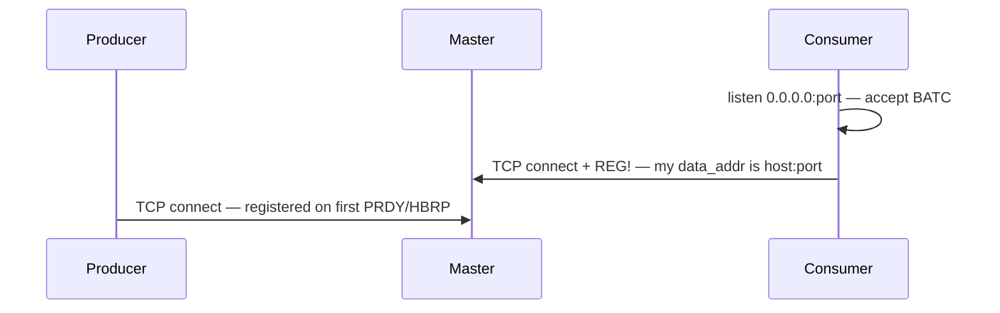
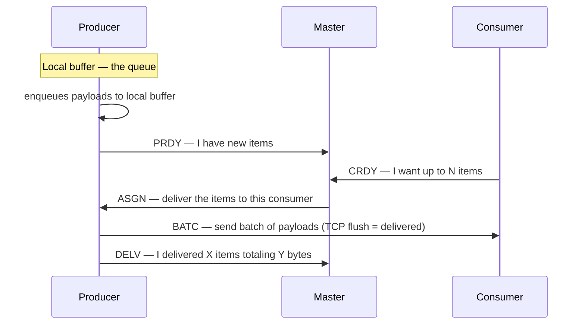

<p align="center">
  
  <br /><br />
  
</p>

<p align="center">
  <strong>Brokerless P2P batch queue — the master only plays matchmaker.</strong><br/>
  Producers and consumers exchange bytes directly; the coordinator never touches your payload.
</p>

<p align="center">
  
  
  
  
</p>

<p align="center">
  <a href="#quick-start">Quick start</a> ·
  <a href="#architecture">Architecture</a> ·
  <a href="#client-libraries">Clients</a> ·
  <a href="#use-in-your-project">Use in your project</a> ·
  <a href="#producer-queue">Producer queue</a> ·
  <a href="#configuration">Configuration</a> ·
  <a href="#load-demo">Load demo</a> ·
  <a href="#development">Development</a> ·
  <a href="RELEASING.md">Releasing</a>
</p>

---

## Overview

**CupidMQ** is a pull-based, brokerless queue for **byte batches**. A lightweight **master** matches producers with backlog to consumers that ask for work, then steps aside. Payloads move on a dedicated **P2P data plane** (`BATC`); the master only handles control signals.

| | Typical broker | CupidMQ |
|---|----------------|---------|
| **Data path** | Producer → broker → consumer | Producer → consumer **directly** |
| **Delivery** | Broker pushes / fan-out | Consumer **pulls** (`CRDY`) |
| **Coordinator state** | Queue bytes (often durable) | **Match state only** — no payload buffer |
| **Producer buffer** | Often implicit / broker-side | **Local queue per producer** (`outbound_max_bytes`, drop-oldest) |
| **Best for** | Routing, replay, small messages | **Large batches**, throughput, P2P OK |

> **Experimental** — API and wire format may change. Pin `main` or a commit SHA; tagged [releases](.github/workflows/release.yml) optional later.

---

## Features

- **Matchmaker, not mailbox** — master assigns pairs; bytes never flow through it
- **Payload-agnostic** — opaque `Bytes` end-to-end; your encoding, your schema
- **Batch-first** — prefetch, caps, and metrics in **batch** units
- **Producer-local queue** — each producer buffers bytes in-process (`outbound_max_bytes`); master has **no** payload queue
- **Consumer pull** — workers declare `max_batch_size_count` and prefetch window via `CRDY`
- **Live dashboard** — topology, throughput, and backlog baked into the master HTTP port (`:9752`)
- **Rust + Python clients** — same wire protocol, same semantics

---

## Architecture

### Setup



Consumer **binds** `0.0.0.0:<port>` for `BATC`, opens control TCP, and sends `REG!` with the **routable** `data_addr`. Producer connects to the master afterward (registered on first `PRDY`/`HBRP`).

### Sequence — one match



Producer buffers payloads and sends `PRDY`. Consumer sends `CRDY`. Master pairs them with `ASGN`. Producer delivers the batch via `BATC`, then reports `DELV` (or `FAIL` on error).

The master **never** buffers batch bytes.

**Design rules**

1. **One master = one logical queue** — scale out with more masters, not more queues on one master
2. **Listen vs advertise** — bind `0.0.0.0`; register a **routable** `data_addr` producers can dial
3. **No central payload buffer** — buffering lives on producers; consumers prefetch locally

Protocol details: [`cupidmq.mdc`](cupidmq.mdc) · [Ports & protocol](#ports--protocol)

---

## Quick start

**Prerequisites:** Rust 1.75+ · [uv](https://docs.astral.sh/uv/) (Python) · Docker (optional)

### 1. Run the master

```bash
docker compose up -d --build
```

| Endpoint | Default |
|----------|---------|
| Control | `127.0.0.1:9750` |
| Dashboard | http://127.0.0.1:9752/ |
| Health / metrics | `/health` · `/metrics` |

Bare metal: copy [`master/cupidmq.conf.example`](master/cupidmq.conf.example) → `cupidmq.conf`, then `cupidmq --config cupidmq.conf`.

### 2. Run a consumer

| Field | Purpose | Example |
|-------|---------|---------|
| `data_addr` | Sent in `REG!` — producer connects here | `127.0.0.1:9760` |
| `bind_addr` | Local listen (optional) | `0.0.0.0:9760` (default) |

**Rust** — [`master/examples/consumer.rs`](master/examples/consumer.rs)

```rust
let mut client = CupidMQ::connect_consumer(
    ConsumerConfig::new("127.0.0.1:9750", "127.0.0.1:9760")?
        .max_batch_size_count(32)
        .prefetch_batch_count(4),
).await?;
client.consume(|batch| async move { /* handle Bytes */ Ok(()) }).await?;
```

**Python** — `cd python-client && uv sync`

```python
async with CupidMQ.consumer("127.0.0.1:9750", data_addr="127.0.0.1:9760") as c:
    async for batch in c.consume():
        ...
```

### 3. Run a producer

**Rust** — [`master/examples/producer.rs`](master/examples/producer.rs)

```rust
let producer = CupidMQ::connect_producer(
        ProducerConfig::new("127.0.0.1:9750")
        .outbound_max_bytes(512 * 1024 * 1024)
        .max_batch_bytes(64 * 1024 * 1024),
).await?;
producer.enqueue(b"payload")?;  // non-blocking — see Producer queue below
```

**Python**

```python
async with CupidMQ.producer("127.0.0.1:9750", outbound_max_bytes=512 * 1024 * 1024) as c:
    c.enqueue(b"payload")  # non-blocking — see Producer queue below
```

---

## Client libraries

Both clients expose **`CupidMQ`** with opaque byte payloads.

### Producer queue

There is **no shared queue on the master** — buffering happens **inside each producer process** until a consumer pulls via `BATC`. Pipeline on that producer:

```
enqueue() → pending ring → batch accumulator → dispatch ring → PRDY/ASGN → BATC
```

All stages share one byte budget on that producer: **`outbound_max_bytes`** (default 4 GiB).

| Rule | Behavior |
|------|----------|
| **Ring at cap** | **Drop oldest** queued payloads until the new item fits — `enqueue` / `publish` **never blocks** |
| **Oversized payload** | Single message larger than `outbound_max_bytes` is **rejected** (dropped) |
| **Visibility** | Drops counted in producer HBRP → metrics `producer_drops_total` and dashboard |
| **Your SLA** | Cap too low → silent loss under burst; cap too high → RAM per producer instance |

Tune `outbound_max_bytes` for how much burst each producer may buffer **while waiting for a consumer**. This is independent of how large one wire transfer may be.

| Setting | Rust · Python | Meaning |
|---------|---------------|---------|
| **`outbound_max_bytes`** | `.outbound_max_bytes()` · `outbound_max_bytes=` | **Producer queue cap** (total in-flight bytes) |
| `max_batch_bytes` | `.max_batch_bytes()` · `max_batch_bytes=` | Max bytes in **one** `BATC` batch (wire), not queue size |
| `flush_timeout_ms` | `.flush_timeout_ms()` · `flush_timeout_ms=` | Partial batch flush wait |
| `delivery_timeout_secs` | `.delivery_timeout_secs()` · `delivery_timeout_secs=` | One BATC attempt timeout |
| `delivery_idle_secs` | `.delivery_idle_secs()` · `delivery_idle_secs=` | Pooled BATC idle cap |
| `heartbeat_interval_ms` | `.heartbeat_interval_ms()` · `heartbeat_interval_ms=` | HBRP interval |
| `max_batch_size_count` | `.max_batch_size_count()` · `max_batch_size_count=` | Max items per `CRDY` |
| `prefetch_batch_count` | `.prefetch_batch_count()` · `prefetch_batch_count=` | Local batch prefetch |
| `batch_timeout_secs` | `.batch_timeout_secs()` · `batch_timeout_secs=` | Wait for BATC after `CRDY` |
| `data_idle_secs` | `.data_idle_secs()` · `data_idle_secs=` | BATC connection idle cap |
| `reconnect_delay_secs` | `.reconnect_delay_secs()` · `reconnect_delay_secs=` | Control reconnect backoff |

### API entry points

| Language | Install / dep | Examples |
|----------|---------------|----------|
| **Rust** | git dep — [Use in your project](#use-in-your-project) | [`producer.rs`](master/examples/producer.rs) · [`consumer.rs`](master/examples/consumer.rs) · [`cupidmq-producer.rs`](master/examples/cupidmq-producer.rs) (load) |
| **Python** | git dep — [Use in your project](#use-in-your-project) | [`cupidmq/client.py`](python-client/cupidmq/client.py) · harness: [`harness/`](python-client/harness/) |

---

## Use in your project

No clone into your monorepo. Branch **`main`** on GitHub (`https://github.com/tecnomarra/cupidmq`). Not on crates.io or PyPI.

### Where each piece comes from

| Piece | Source | Pin |
|-------|--------|-----|
| **Master binary** | **GitHub Release** | download `cupidmq` / `cupidmq-producer` |
| **Master Docker** | **Git repo** | `#main` or `#v0.1.0` |
| **Rust crate** | **Git repo** | `branch` / `tag` / `rev` + `path = "master"` |
| **Python lib** | **Git repo** *or* **Release wheel** | `@main` / `@v0.1.0` *or* `.whl` URL |

Multiple tags (`v0.1.0`, `v0.1.1`, …) on the same `main` history — each tag = one Release snapshot.

### Master binary (Release)

After `git push origin v0.1.0` → [Release assets](https://github.com/tecnomarra/cupidmq/releases):

```bash
# Linux example — pick the asset for your OS
chmod +x cupidmq
./cupidmq --config cupidmq.conf.example
```

Also on each Release: `cupidmq-producer`, `cupidmq.conf.example`.

### Master Docker (git)

```bash
docker build -t cupidmq-master https://github.com/tecnomarra/cupidmq.git#main
docker run -d -p 9750:9750 -p 9752:9752 cupidmq-master
```

Pinned release:

```yaml
services:
  cupidmq-master:
    build:
      context: https://github.com/tecnomarra/cupidmq.git#v0.1.0
    ports: ["9750:9750", "9752:9752"]
```

### Rust crate (git + tags)

Folder `master/` ≠ branch name. Cargo **cannot** `cargo add` a Release `.crate` URL — use **git**:

```toml
# fixed release (same commit as Release v0.1.0)
cupidmq = { git = "https://github.com/tecnomarra/cupidmq.git", tag = "v0.1.0", path = "master" }

# rolling HEAD of main
cupidmq = { git = "https://github.com/tecnomarra/cupidmq.git", branch = "main", path = "master" }
```

```rust
use cupidmq::{CupidMQ, ProducerConfig};

#[tokio::main]
async fn main() -> anyhow::Result<()> {
    let p = CupidMQ::connect_producer(ProducerConfig::new("127.0.0.1:9750")).await?;
    p.enqueue(b"hello")?;
    Ok(())
}
```

### Python lib (Release *or* git)

**Release wheel** (recommended for pinned prod):

```bash
pip install "https://github.com/tecnomarra/cupidmq/releases/download/v0.1.0/cupidmq_client-0.1.0-py3-none-any.whl"
uv add "cupidmq-client @ https://github.com/tecnomarra/cupidmq/releases/download/v0.1.0/cupidmq_client-0.1.0-py3-none-any.whl"
```

**Git** (rolling `main` or tag):

```bash
uv add "cupidmq-client @ git+https://github.com/tecnomarra/cupidmq.git@main#subdirectory=python-client"
uv add "cupidmq-client @ git+https://github.com/tecnomarra/cupidmq.git@v0.1.0#subdirectory=python-client"
```

Package `cupidmq-client` · import `cupidmq` · Python ≥ 3.11.

### Publish a release (maintainers)

1. Bump `master/Cargo.toml` + `python-client/pyproject.toml` to `0.1.0`
2. `make check-release TAG=v0.1.0`
3. `git tag v0.1.0 && git push origin v0.1.0`

→ [`.github/workflows/release.yml`](.github/workflows/release.yml) uploads binaries, `.crate`, wheel, sdist. Details: [RELEASING.md](RELEASING.md).

---

## Configuration

### Master (`master/cupidmq.conf`)

```ini
host=0.0.0.0          # bind — all interfaces
control_port=9750
metrics_port=9752
history_interval_ms=2000
history_cap=1800
```

Clients **connect** to a routable address (e.g. `127.0.0.1:9750`), not necessarily the bind host.

### Consumer addresses

| | Rust | Python | Docker env |
|---|------|--------|------------|
| Advertise (`REG!`) | `data_addr` | `data_addr=` | `CUPIDMQ_DATA_ADDR` |
| Listen (`BATC`) | `.bind_addr()` | `bind_addr=` | `CUPIDMQ_BIND_ADDR` |

Integration entrypoint sets `advertise=${CUPIDMQ_ADVERTISE_HOST}:PORT` and `bind=0.0.0.0:PORT` automatically — see [`docker/entrypoint-consumer.sh`](docker/entrypoint-consumer.sh).

### Ports & protocol

| Port | Plane | Traffic |
|------|-------|---------|
| **9750** | Control | `PRDY` `HBRP` `ASGN` `DELV` `FAIL` · `REG!` `CRDY` |
| **9752** | Metrics | HTTP `/metrics` `/health` + dashboard |
| **9760+** | Data | `BATC` producer → consumer (P2P) |

Producer and consumer sessions share **one control port**; the first 4-byte frame magic demuxes the role.

---

## Load demo

Full stack — master + 8 producers + 8 Rust + 8 Python consumers, no application code.

**Linux / WSL** (host network):

```bash
cp test-environments/integration/.env.example test-environments/integration/.env
make docker-up
```

**Docker Desktop** (bridge, 4 fixed consumers):

```bash
docker compose -f test-environments/integration/docker-compose.bridge.yml up --build
```

Dashboard: http://127.0.0.1:9752/ — details in [`test-environments/integration/README.md`](test-environments/integration/README.md).

---

## When to use

| Use CupidMQ when… | Use a broker when… |
|-------------------|-------------------|
| High-volume **byte batches** | You need **durability / replay / DLQ** |
| **Pull** + explicit worker capacity | Sub-ms **single-message** latency |
| P2P TCP is acceptable on your network | Complex **routing** on one shared queue |
| You want the coordinator **off the data path** | Fan-out to many subscribers from one copy |

---

## Project structure

```
cupidmq/
├── master/              # Rust daemon + client library
├── python-client/       # Python client + dev harness (uv)
├── dashboard/           # Vite + React metrics UI
├── docker/              # Dockerfiles, entrypoints
├── test-environments/   # Integration compose + stress presets
├── docker-compose.yml   # Master-only deploy
└── cupidmq.mdc          # Protocol & ops map (Cursor)
```

---

## Development

```bash
make help           # all targets
make run            # master from source
make build          # release + cupidmq-producer
make test-rust      # cargo test
make test-python    # uv sync + unittest
make consumer-run   # Python harness (uv)
make producer-run   # synthetic load
make dashboard      # Vite dev → :5175
make docker-master-up
make docker-up      # integration demo
make stress         # 16p × 20c preset
make publish        # binaries → dist/
```

**Hello walkthrough** (three terminals):

```bash
make run
cd master && cargo run --release --example consumer
cd master && cargo run --release --example producer
```

**CI** — push `main`: [`.github/workflows/ci.yml`](.github/workflows/ci.yml). **Release** — tag `v*`: [RELEASING.md](RELEASING.md).

---

<p align="center">
  <sub>Consumers pull · master assigns · bytes go direct over BATC.</sub>
</p>
