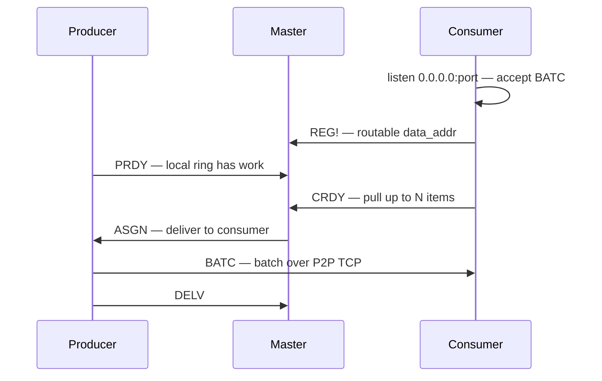

<p align="center">
  
  <br /><br />
  
</p>

<p align="center">
  <strong>High-throughput messaging when freshness beats durability.</strong><br/>
  Bounded producer queues · drop-oldest under pressure · P2P batch delivery
</p>

<p align="center">
  
  
  
  
</p>

---

## The problem

Most message brokers try to preserve every message.

CupidMQ does not.

It is built for real-time workloads where fresh data is more valuable than old data, especially when messages are large: camera streams, AI pipelines, telemetry, and live dashboards.

When consumers fall behind, traditional queues accumulate backlog. As the backlog grows, consumers spend more time processing the past than the present, making it difficult or impossible to return to real-time operation. With large payloads, this backlog can quickly consume significant amounts of memory and bandwidth.

**CupidMQ prioritizes freshness over durability.**

Each producer owns a bounded in-memory queue. When it fills up, the oldest messages are discarded to make room for newer ones.

No replay. No durable storage. No unbounded backlog.

That alone is not enough for large real-time batches. You also need the **data plane off the broker**.

---

## Why P2P

In a classic broker, **every byte crosses the middle**:

```text
Producer ──► Broker (queue, disk, fan-out) ──► Consumer
              ▲
              └── bandwidth + RAM scale with total throughput
```

With camera frames, inference batches, or multi‑MB blobs, the broker becomes the choke point — copy in, copy out, and backlog lands in **one** place.

**CupidMQ splits control from data:**

```text
Control (small)                 Data (large)
───────────────                 ────────────
Producer ──► Master ◄── Consumer     Producer ═══ BATC ═══► Consumer
             match only              direct TCP, no middle hop
```

The **master** is a matchmaker: consumers register (`REG!`), ask for work (`CRDY`), producers signal backlog (`PRDY`), master replies with **`ASGN`** — *who delivers to whom*. Payloads never pass through it.

**Why that matters**

| | Central broker | CupidMQ P2P |
|---|----------------|-------------|
| **Payload path** | All traffic through one service | Producer → consumer **directly** |
| **Scale limit** | Broker CPU/RAM/network | Endpoints + match state (lightweight) |
| **Large batches** | Expensive to buffer centrally | Buffered **on producers** (bounded, drop-oldest) |
| **Freshness under load** | Backlog piles up **in the broker** | Backlog bounded **per producer**; stale data dropped locally |

P2P is not a gimmick — it is how CupidMQ keeps **high-volume byte batches** off a shared queue while still coordinating **who pulls what**. You need routable TCP between producers and consumers (same LAN, VPC, or host network); if every hop must go through a single gateway appliance, a traditional broker may fit better.

More detail: [Architecture](#architecture) · [Producer queue](#producer-queue)

---

## Good fit · Not for

| ✅ Good fit | ❌ Not for |
|------------|-----------|
| Video / camera analytics pipelines | Guaranteed delivery |
| AI inference & batch workers | Message replay |
| Telemetry & IoT sensor streams | Durable queues |
| Live ops dashboards | Financial transactions |
| Edge ingest with burst traffic | Order processing |
| Workloads where **latest &gt; oldest** | Audit logs · event sourcing |

### Do **not** use CupidMQ if you need:

- Guaranteed at-least-once or exactly-once delivery
- Persistent queues or replay after outage
- A central broker that holds copies of every message
- Complex routing / fan-out from one shared durable queue

Use **RabbitMQ**, **Kafka**, or **NATS** (with JetStream) for those cases.

---

## How it compares

| | **CupidMQ** | **RabbitMQ** | **Kafka** | **NATS** |
|---|:---:|:---:|:---:|:---:|
| **Fresh-data / drop-old under load** | ✅ by design | ⚠️ backlog grows | ⚠️ retention lag | ⚠️ depends on config |
| **Bounded memory per producer** | ✅ `outbound_max_bytes` | ❌ broker buffers | ❌ log retention | ⚠️ |
| **Payload through coordinator** | ❌ P2P only | ✅ via broker | ✅ via broker | ✅ via server |
| **Durable storage / replay** | ❌ | ✅ | ✅ | ✅ (JetStream) |
| **Large opaque byte batches** | ✅ BATC | ⚠️ | ⚠️ | ⚠️ |
| **Consumer pull + explicit capacity** | ✅ `CRDY` | ⚠️ push-oriented | ⚠️ | ✅ |

CupidMQ is **not** “a faster RabbitMQ”. It solves a **different** problem: **keep real-time streams moving** when controlled loss is acceptable.

---

## Why it exists

CupidMQ came from operating large real-time streaming stacks where **backlog growth** caused more pain than **controlled message loss**.

Traditional brokers optimize for **durability and ordering**. CupidMQ optimizes for **throughput and freshness**: brokerless matchmaking, direct producer→consumer TCP batches, and **drop-oldest** producer rings instead of unbounded central queues.

---

## Drop-oldest is a feature

Traditional brokers accumulate backlog until disk, memory, or ops intervene.

CupidMQ keeps producer memory **bounded by design**:

```text
Producer enqueue (never blocks)
        │
        ▼
┌─────────────────────┐
│  bounded byte ring  │  ← outbound_max_bytes per producer
└─────────────────────┘
        │
   ring full?
        │
        ▼
 drop oldest ──► make room for new data
        │
        ▼
 Consumer pull (CRDY) ──► BATC batch (P2P TCP)
```

When consumers cannot keep up, **old messages are discarded** so the system keeps moving and workers receive the **newest** data the pipeline can still carry. Drops are visible in metrics (`producer_drops_total`) and the dashboard — tune `outbound_max_bytes` for your burst SLA.

Details: [Producer queue](#producer-queue)

---

## Reference load test

Not a formal audited benchmark — reproducible **integration stress** shipped in this repo.

| | |
|---|---|
| **Preset** | `stress-16p-20c-tcp-mult8` ([JSON](test-environments/presets/stress-16p-20c-tcp-mult8.json)) |
| **Topology** | 16 producers · 20 consumers · TCP BATC keep-alive |
| **Payload** | 8 KiB synthetic bytes · batch mode · flush 100 ms |
| **Publish rate** | 512 msg/s × 8 mult per producer |
| **Observed** | ~**300–400 BATC batches/s** sustained · `delivery_failures_total = 0` with keep-alive pool |

```bash
make stress          # or: make docker-up for full compose stack
# dashboard: http://127.0.0.1:9752/
```

Run on your hardware and compare — we welcome PRs with published results.

---

<p align="center">
  <a href="#why-p2p">Why P2P</a> ·
  <a href="#quick-start">Quick start</a> ·
  <a href="#architecture">Architecture</a> ·
  <a href="#client-libraries">Clients</a> ·
  <a href="#use-in-your-project">Use in your project</a> ·
  <a href="#configuration">Configuration</a> ·
  <a href="#development">Development</a>
</p>

> **Experimental** — API and wire format may change. [Releases](https://github.com/WilianZilv/cupidmq/releases) · [RELEASING.md](RELEASING.md)

---

## Quick start

**Prerequisites:** Rust 1.75+ · [uv](https://docs.astral.sh/uv/) (Python) · Docker (optional)

### 1. Run the master

```bash
docker compose up -d --build
```

| Endpoint | Default |
|----------|---------|
| Control | `127.0.0.1:9750` |
| Dashboard | http://127.0.0.1:9752/ |

Bare metal: [`master/cupidmq.conf.example`](master/cupidmq.conf.example) → `cupidmq --config cupidmq.conf`

### 2. Run a consumer

```rust
// master/examples/consumer.rs
let mut client = CupidMQ::connect_consumer(
    ConsumerConfig::new("127.0.0.1:9750", "127.0.0.1:9760")?
        .max_batch_size_count(32),
).await?;
client.consume(|batch| async move { Ok(()) }).await?;
```

```python
async with CupidMQ.consumer("127.0.0.1:9750", data_addr="127.0.0.1:9760") as c:
    async for batch in c.consume():
        ...
```

### 3. Run a producer

```rust
let producer = CupidMQ::connect_producer(
    ProducerConfig::new("127.0.0.1:9750").outbound_max_bytes(512 * 1024 * 1024),
).await?;
producer.enqueue(b"payload")?;  // non-blocking
```

```python
async with CupidMQ.producer("127.0.0.1:9750", outbound_max_bytes=512 * 1024 * 1024) as c:
    c.enqueue(b"payload")
```

---

## Architecture



- **Master** — matchmaker only (control + metrics). **No payload buffer.**
- **Data plane** — producer → consumer **directly** (`BATC`).
- **One master = one logical queue** — scale out with more masters.

Protocol map: [`cupidmq.mdc`](cupidmq.mdc)

---

## Client libraries

Rust + Python · opaque `Bytes` end-to-end · same wire protocol.

### Producer queue

Buffering is **per producer**, not on the master:

```
enqueue() → pending ring → batch accumulator → dispatch ring → BATC
```

| Rule | Behavior |
|------|----------|
| **Ring at cap** | **Drop oldest** — `enqueue` / `publish` **never blocks** |
| **Oversized item** | Larger than `outbound_max_bytes` → dropped |
| **Metrics** | `producer_drops_total` on dashboard `:9752` |

| Setting | Meaning |
|---------|---------|
| **`outbound_max_bytes`** | Producer queue cap (default 4 GiB) |
| `max_batch_bytes` | Max bytes per **one** `BATC` transfer |
| `max_batch_size_count` | Max items per consumer `CRDY` |

Examples: [`producer.rs`](master/examples/producer.rs) · [`consumer.rs`](master/examples/consumer.rs) · [`client.py`](python-client/cupidmq/client.py)

---

## Use in your project

Branch **`main`** · `https://github.com/WilianZilv/cupidmq` · not on crates.io / PyPI yet.

| Piece | Source | Pin |
|-------|--------|-----|
| **Master binary** | [GitHub Release](https://github.com/WilianZilv/cupidmq/releases) | `cupidmq` / `cupidmq.exe` |
| **Master Docker** | git | `#main` or `#v0.1.0` |
| **Rust crate** | git | `tag` / `branch` + `path = "master"` |
| **Python** | Release **wheel** or git | `.whl` URL or `@main` |

```toml
cupidmq = { git = "https://github.com/WilianZilv/cupidmq.git", tag = "v0.1.0", path = "master" }
```

```bash
pip install "https://github.com/WilianZilv/cupidmq/releases/download/v0.1.0/cupidmq_client-0.1.0-py3-none-any.whl"
```

Full install paths: [RELEASING.md](RELEASING.md)

---

## Configuration

```ini
# master/cupidmq.conf
host=0.0.0.0
control_port=9750
metrics_port=9752
```

| Port | Role |
|------|------|
| **9750** | Control — `PRDY` `CRDY` `ASGN` `REG!` … |
| **9752** | HTTP metrics + dashboard |
| **9760+** | Data — `BATC` (P2P, per consumer) |

Consumer: advertise routable `data_addr` in `REG!`; bind `0.0.0.0:<port>` for `BATC`.

---

## Load demo

```bash
cp test-environments/integration/.env.example test-environments/integration/.env
make docker-up      # 8p + 8 rust + 8 py consumers
make docker-down    # stop — from repo root
```

Bridge fallback (Docker Desktop): [`docker-compose.bridge.yml`](test-environments/integration/docker-compose.bridge.yml)

---

## Project structure

```
cupidmq/
├── master/              # Rust daemon + client library
├── python-client/       # Python client (uv)
├── dashboard/           # Metrics UI (:9752)
├── test-environments/   # Stress presets + integration compose
└── cupidmq.mdc          # Protocol & ops map
```

---

## Development

```bash
make test-rust && make test-python
make run && make producer-run && make consumer-run
make stress
```

CI: [`.github/workflows/ci.yml`](.github/workflows/ci.yml)

---

<p align="center">
  <sub>Freshness over durability · consumers pull · bytes go direct over BATC</sub>
</p>
